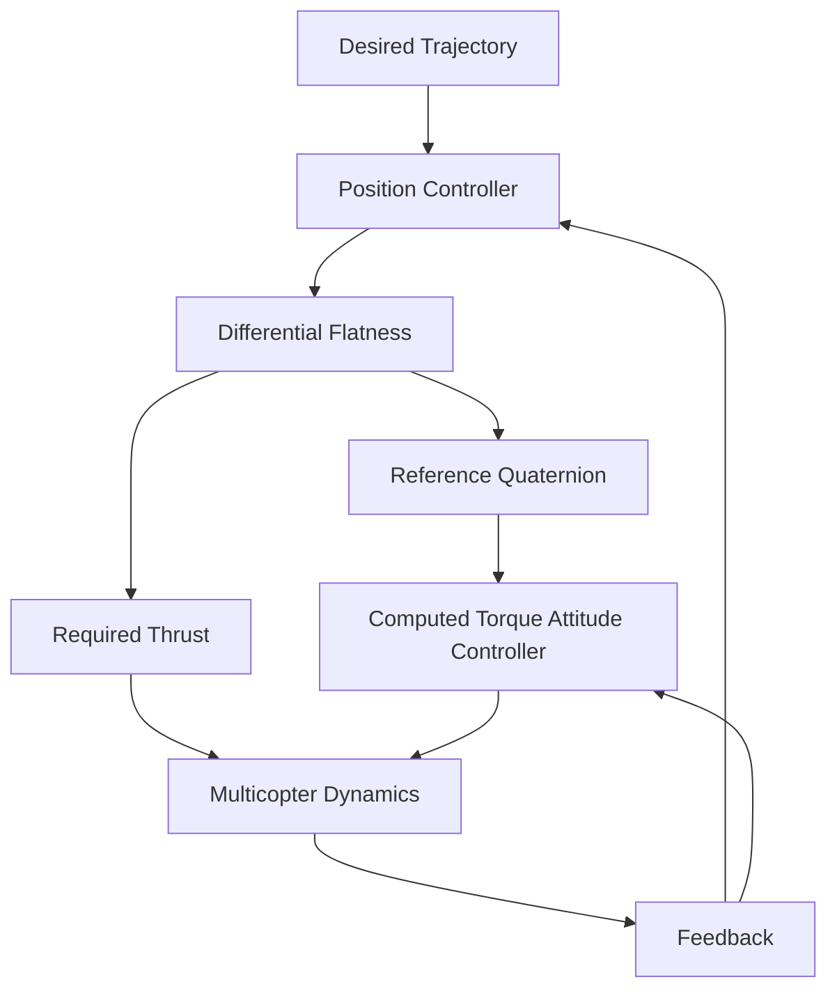

  

<h2 align="center">
Trajectory Tracking for a Multicopter under a Quaternion Representation
</h2>

---

## Team Members

| S. No. | Name | Roll Number | Email |
|---|---|---|---|
| 1 | Majji Jayesh | cb.sc.u4aie24128 | cb.sc.u4aie24128@cb.students.amrita.edu |
| 2 | Kotyada Siva Adityan | cb.sc.u4aie24126 | cb.sc.u4aie24126@cb.students.amrita.edu |
| 3 | Mandavalli Vishnu Teja | cb.sc.u4aie24130 | cb.sc.u4aie24130@cb.students.amrita.edu |
| 4 | Muvva Venkata Mukesh| cb.sc.u4aie24138 | cb.sc.u4aie24138@cb.students.amrita.edu |
| 5 | Narni Srinivas | cb.sc.u4aie24140 | cb.sc.u4aie24140@cb.students.amrita.edu |
# Abstract

This project implements the multicopter trajectory-tracking control methodology presented in the base paper using a quaternion-based nonlinear dynamic model. The approach combines differential flatness, feedback linearization, and computed-torque control to achieve accurate position and attitude tracking. The multicopter attitude is represented using unit quaternions, avoiding the singularities associated with Euler-angle representations. The high-level position controller uses position, velocity, and integral tracking errors to generate the required translational acceleration. Differential-flatness relations then convert this acceleration into the required thrust and reference quaternion. A low-level computed-torque controller tracks the reference quaternion while compensating for the nonlinear rotational dynamics. The complete methodology is implemented in simulation to evaluate trajectory tracking and the controller's response to disturbances.

# Introduction

Multicopters are nonlinear, underactuated aerial vehicles whose position and attitude are strongly coupled. Accurate trajectory tracking therefore requires a control strategy capable of handling both the nonlinear translational and rotational dynamics of the vehicle. Conventional Euler-angle representations can also introduce singularities and complicate the mathematical formulation of three-dimensional attitude control.

This project implements the multicopter trajectory-tracking methodology presented in the base paper using a quaternion-based dynamic model. Quaternions are used to represent the vehicle attitude because they provide a compact representation of three-dimensional orientation without the singularities associated with Euler angles.

The implemented control architecture uses differential flatness to establish a relationship between the desired trajectory and the required thrust and attitude. A high-level feedback-linearization controller generates the required translational acceleration from the position tracking error. This acceleration is then transformed into the required thrust and reference quaternion using the differential-flatness formulation.

A low-level computed-torque controller is used to track the reference quaternion while compensating for the nonlinear rotational dynamics of the multicopter. The complete system combines the nonlinear dynamic model, quaternion kinematics, differential flatness, feedback linearization, and computed-torque attitude control into a hierarchical trajectory-tracking framework. The implementation is evaluated through simulation to study position and attitude tracking performance.

$$
\text{Desired Trajectory}
\rightarrow
\text{Position Controller}
\rightarrow
\text{Desired Acceleration}
\rightarrow
(T,q_r)
\rightarrow
\text{Attitude Controller}
\rightarrow
\text{Multicopter Dynamics}
$$

The methodology implemented in this project is based on the differential-flatness property of the multicopter system. The flat output is defined using the vehicle position and one quaternion component, allowing the remaining states and control inputs to be obtained algebraically from the flat output and its derivatives. This provides a systematic way of generating the thrust and attitude required to follow a given trajectory.

The position controller applies feedback linearization to the nonlinear translational dynamics. The resulting tracking problem is transformed into a linear error-dynamics problem, where proportional, derivative, and integral feedback terms are used to reduce the position tracking error. The resulting desired acceleration is subsequently used to calculate the reference quaternion and thrust.

For attitude control, the implementation uses computed-torque control. The nonlinear coupling present in the rotational dynamics is compensated using the system's inertia matrix, quaternion kinematics, and angular-velocity-dependent terms. This allows the attitude controller to focus on reducing the quaternion tracking error and provides fast convergence of the attitude toward its reference.

The complete implementation therefore integrates the multicopter dynamic model, quaternion representation, differential flatness, feedback linearization, and computed-torque control into a single trajectory-tracking framework. Simulation and experimental results are used to evaluate the ability of the implemented controller to track the desired trajectory and reject external disturbances.

# Methodology

## 1. Overall Methodology

The project implements the **two-layer hierarchical trajectory-tracking control scheme** proposed in the base paper. The methodology is based on the complete nonlinear multicopter model expressed using a unit quaternion, followed by differential-flatness-based feedback linearization for position control and computed-torque control for attitude stabilization. The same control structure described in the paper is implemented without changing the core methodology. :contentReference[oaicite:0]{index=0}

The complete control methodology consists of the following stages:

1. Model the multicopter translational and rotational dynamics.
2. Represent the multicopter attitude using a unit quaternion.
3. Obtain the rotation matrix from the quaternion.
4. Relate quaternion derivatives to the body angular velocity.
5. Establish the differential-flatness representation of the multicopter.
6. Select the flat output as the three-dimensional position and the fourth quaternion component.
7. Calculate the required thrust and quaternion components from the desired translational acceleration.
8. Use the high-level feedback-linearization position controller to generate the corrected desired acceleration.
9. Generate the reference quaternion and thrust from the corrected acceleration.
10. Send the three vector components of the reference quaternion to the low-level attitude controller.
11. Use computed-torque control to compensate for the nonlinear rotational dynamics.
12. Track the reference quaternion using proportional, derivative, and integral quaternion feedback.
13. Propagate the resulting translational and rotational dynamics.
14. Evaluate the trajectory-tracking performance through simulation and experimental results.
## 2. Methodology Flow Diagram

The complete control architecture implemented in this project is shown below.

The architecture consists of a high-level position controller and a low-level attitude controller. The position controller generates the required acceleration, which is converted through differential flatness into the reference quaternion and thrust. The computed-torque attitude controller generates the required control torque, and both thrust and torque are applied to the multicopter dynamics. The resulting states are fed back to the controllers.
The architecture is therefore

$$
\text{Reference Position}
\rightarrow
\text{Position Error}
\rightarrow
\text{Feedback Linearization}
\rightarrow
\left(T,q_r\right)
\rightarrow
\text{Computed-Torque Attitude Control}
\rightarrow
\text{Multicopter Dynamics}.
$$

The low-level attitude controller is operated at a higher frequency than the high-level position controller so that the attitude subsystem can track the generated reference quaternion sufficiently fast. 

---

## 3. Multicopter State Representation

The multicopter position is represented by

$$
\xi =
\begin{bmatrix}
x & y & z
\end{bmatrix}^{T},
$$

where $x$, $y$, and $z$ represent the position of the multicopter in the global frame.

The body angular velocity is

$$
\omega =
\begin{bmatrix}
\omega_x & \omega_y & \omega_z
\end{bmatrix}^{T}.
$$

The attitude is represented using the unit quaternion

$$
q =
\begin{bmatrix}
q_0 & q_1 & q_2 & q_3
\end{bmatrix}^{T},
$$

where $q_0$ is the scalar component and

$$
q =
\begin{bmatrix}
q_1 & q_2 & q_3
\end{bmatrix}^{T}
$$

contains the remaining three components.

The quaternion satisfies the unit-norm constraint

$$
q_0^2+q_1^2+q_2^2+q_3^2=1,
$$

with

$$
q_0\geq0.
$$

Therefore, the scalar component can be reconstructed from the three vector components as

$$
q_0=
\sqrt{1-q_1^2-q_2^2-q_3^2}.
$$

This reduced representation is important because the control formulation directly uses the three components $q_1,q_2,q_3$, while $q_0$ is obtained from the unit-norm constraint.

---

## 4. Quaternion Rotation Matrix

The orientation of the multicopter body frame with respect to the global frame is represented by the rotation matrix

$$
R=
\begin{bmatrix}
1-2(q_2^2+q_3^2)
&
2(q_1q_2-q_0q_3)
&
2(q_0q_2+q_1q_3)
\\
2(q_1q_2+q_0q_3)
&
1-2(q_1^2+q_3^2)
&
2(q_2q_3-q_0q_1)
\\
2(q_1q_3-q_0q_2)
&
2(q_0q_1+q_2q_3)
&
1-2(q_1^2+q_2^2)
\end{bmatrix}.
$$

The rotation matrix determines the direction of the multicopter thrust in the global coordinate frame and therefore directly connects the attitude to the translational motion. 

---

## 5. Quaternion Kinematics

The relationship between quaternion derivative and body angular velocity is

$$
\dot q=\frac{1}{2}q\otimes\bar{\omega},
$$

where

$$
\bar{\omega}=
\begin{bmatrix}
0 & \omega_x & \omega_y & \omega_z
\end{bmatrix}^{T}.
$$

The corresponding inverse relationship is

$$
\omega_x=2(-q_1\dot{q}_0+q_0\dot{q}_1-q_3\dot{q}_2+q_2\dot{q}_3)
$$

$$
\omega_y=2(-q_2\dot{q}_0+q_3\dot{q}_1+q_0\dot{q}_2-q_1\dot{q}_3)
$$

$$
\omega_z=2(-q_3\dot{q}_0-q_2\dot{q}_1+q_1\dot{q}_2+q_0\dot{q}_3)
$$

Using the reduced quaternion vector, this relationship can be written as

$$
\omega=Q(q)\dot{q}
$$

Using the reduced quaternion vector, this is written compactly as

$$
\omega=Q(q)\dot q.
$$

The matrix $Q(q)$ is obtained using the unit-quaternion relation

$$
q_0=
\sqrt{1-q_1^2-q_2^2-q_3^2}.
$$

These equations provide the connection between quaternion motion and rotational dynamics required by the computed-torque controller.

---

## 6. Nonlinear Translational Dynamics

The translational motion of the multicopter is described by Newton's second law:

$$
m\ddot{\xi}=mg+Re_zT
$$

where $m$ is the multicopter mass, $g$ is the gravitational acceleration, $R$ is the rotation matrix, $e_z$ is the unit vector along the vertical axis, and $T$ is the total thrust.

The position vector is

$$
\xi=
\begin{bmatrix}
x\\
y\\
z
\end{bmatrix}
$$

and the vertical unit vector is

$$
e_z=
\begin{bmatrix}
0\\
0\\
1
\end{bmatrix}
$$

Expanding the translational dynamics gives:

$$
m\ddot{x}=2T(q_0q_2+q_1q_3)
$$

$$
m\ddot{y}=2T(q_2q_3-q_0q_1)
$$

$$
m\ddot{z}=-mg+T(q_0^2-q_1^2-q_2^2+q_3^2)
$$

The translational dynamics are:

$$
m\ddot{\xi}=mg+Re_zT
$$

## 7. Nonlinear Rotational Dynamics

The rotational motion of the multicopter is modeled using the rigid-body rotational dynamics:

$$
J\dot{\omega}+\omega\times(J\omega)=\tau
$$

where $J$ is the inertia matrix, $\omega$ is the body angular velocity, and $\tau$ is the control torque.

The angular velocity is defined as

$$
\omega=
\begin{bmatrix}
\omega_x & \omega_y & \omega_z
\end{bmatrix}^{T}
$$

and the control torque is

$$
\tau=
\begin{bmatrix}
\tau_x & \tau_y & \tau_z
\end{bmatrix}^{T}.
$$

For the multicopter model, the inertia matrix is

$$
J=
\begin{bmatrix}
J_x & 0 & 0\\
0 & J_y & 0\\
0 & 0 & J_z
\end{bmatrix}
$$

The rotational dynamics can be expanded into three equations:

$$
\dot{\omega}_x=
\frac{J_y-J_z}{J_x}\omega_y\omega_z+
\frac{\tau_x}{J_x}
$$

$$
\dot{\omega}_y=
\frac{J_z-J_x}{J_y}\omega_z\omega_x+
\frac{\tau_y}{J_y}
$$

$$
\dot{\omega}_z=
\frac{J_x-J_y}{J_z}\omega_x\omega_y+
\frac{\tau_z}{J_z}
$$

These equations describe the nonlinear rotational behavior of the multicopter. The angular-velocity coupling terms are compensated by the computed-torque controller in the attitude-control layer.

## 8. Differential Flatness

The multicopter system is differentially flat. This property allows the system states and control inputs to be obtained from a suitable flat output and a finite number of its derivatives.

The flat output used in the proposed methodology is

$$
z=
\begin{bmatrix}
x & y & z & q_3
\end{bmatrix}^{T}
$$

where $x$, $y$, and $z$ are the multicopter position coordinates and $q_3$ is the fourth component of the unit quaternion.

The remaining quaternion component is obtained from the unit-norm constraint:

$$
q_0=
\sqrt{1-q_1^2-q_2^2-q_3^2}
$$

The differential-flatness property allows the required thrust and attitude to be calculated from the desired translational acceleration.

The required thrust is

$$
T=
m\sqrt{
\ddot{x}^{2}
+
\ddot{y}^{2}
+
(\ddot{z}+g)^{2}
}
$$

Define

$$
D=
\sqrt{
\ddot{x}^{2}
+
\ddot{y}^{2}
+
(\ddot{z}+g)^{2}
}
$$

The reference quaternion components are then obtained from the desired acceleration and the selected value of $q_3$.

The scalar component is

$$
q_0=
\frac{1}{\sqrt{2}}
\sqrt{
\frac{\ddot{z}+g}{D}
-2q_3^2+1
}
$$

The first vector component is

$$
q_1=\frac{\ddot{x}q_3-\frac{\ddot{y}}{\sqrt{2}}\sqrt{\frac{\ddot{z}+g}{D}-2q_3^2+1}}{\ddot{z}+g+D}
$$

The second vector component is

$$
q_2=
\frac{
\ddot{y}q_3
+
\frac{\ddot{x}}{\sqrt{2}}
\sqrt{
\frac{\ddot{z}+g}{D}
-2q_3^2+1
}
}{
\ddot{z}+g+D
}
$$

Thus, the desired translational acceleration determines the required thrust and the reference quaternion. This forms the main connection between the high-level position controller and the low-level attitude controller.

The reference values can therefore be represented as

$$
T=T(\ddot{\xi})
$$

and

$$
q_r=q_r(\ddot{\xi},q_{3r})
$$

where $q_{3r}$ is the selected reference value of the flat-output quaternion component.
## 9. Feedback-Linearization Position Controller

The position controller uses feedback linearization to transform the nonlinear translational dynamics into a linear error-dynamics problem.

The position tracking error is defined as

$$
\epsilon_{\xi}=\xi_r-\xi
$$

The corrective acceleration is defined as

$$
\ddot{\xi}^{*}=
\ddot{\xi}_r+
K_{p\xi}\epsilon_{\xi}+
K_{d\xi}\dot{\epsilon}_{\xi}+
K_{i\xi}\int\epsilon_{\xi}\,dt
$$

where $\xi_r$ is the desired position, $\xi$ is the actual position, and $K_{p\xi}$, $K_{d\xi}$, and $K_{i\xi}$ are the proportional, derivative, and integral gain matrices.

The corrective acceleration is then used to calculate the required thrust and reference quaternion:

$$
q_{ir}=\Gamma_{q_i}(\xi^{*},q_{3r})
$$

$$
T=\Gamma_T(\xi^{*})
$$

where $q_{3r}$ is the reference value of the flat-output quaternion component.

The resulting closed-loop position error dynamics are

$$
\ddot{\epsilon}_{\xi}
+
K_{p\xi}\epsilon_{\xi}
+
K_{d\xi}\dot{\epsilon}_{\xi}
+
K_{i\xi}\int\epsilon_{\xi}\,dt
=0
$$

Thus, the nonlinear position-tracking problem is converted into a linear error-dynamics problem through feedback linearization. The resulting thrust and reference quaternion are passed to the attitude-control layer.

## 10. Computed-Torque Attitude Controller

The low-level attitude controller uses the Computed Torque Control (CTC) method to compensate for the nonlinear rotational dynamics of the multicopter.

The input torque is calculated as

$$
\tau=JQ(q)\tilde{\tau}+JD_q[Q(q)\dot{q}]\dot{q}+[Q(q)\dot{q}]\times[JQ(q)\dot{q}]
$$

where $J$ is the inertia tensor, $Q(q)$ is the quaternion transformation matrix, and $D_q$ represents the Jacobian with respect to the quaternion.

The corrective term is

$$
\tilde{\tau}=\ddot{q}_r+K_{pq}\epsilon_q+K_{dq}\dot{\epsilon}_q+K_{iq}\int\epsilon_q\,dt
$$

The quaternion tracking error is

$$
\epsilon_q=q_r-q
$$

where $q_r$ is the reference quaternion generated by the position controller and $q$ is the measured quaternion.

The matrices $K_{pq}$, $K_{dq}$, and $K_{iq}$ are diagonal positive definite gain matrices.

The attitude controller tracks the last three components of the reference quaternion:

$$
q_r=
\begin{bmatrix}
q_{0r}\\
q_{1r}\\
q_{2r}\\
q_{3r}
\end{bmatrix}
$$

The controller directly tracks $q_{1r}$, $q_{2r}$, and $q_{3r}$. The first quaternion component $q_0$ converges to its reference value through the unit-quaternion constraint.

The unit-quaternion constraint is

$$
q_0^2+q_1^2+q_2^2+q_3^2=1
$$

and similarly for the reference quaternion,

$$
q_{0r}^2+q_{1r}^2+q_{2r}^2+q_{3r}^2=1
$$

Therefore, convergence of the three tracked quaternion components also ensures convergence of the remaining quaternion component.

## Results

# 11. MATLAB/Simulink Simulation Results

The implemented quaternion-based quadrotor controller was evaluated in MATLAB/Simulink to verify the complete control architecture and trajectory-tracking performance.

## 11.1 Complete Simulink Model

The complete MATLAB/Simulink model integrates the reference trajectory, position controller, differential-flatness mapping, attitude controller, and quadrotor dynamics.

*Figure 1. Complete MATLAB/Simulink model for quaternion-based quadrotor control.*

## 11.2 Reference Trajectory Generation

The reference trajectory block generates the desired position, velocity, acceleration, and reference attitude required by the controller.

*Figure 2. Reference trajectory generation block implemented in MATLAB/Simulink.*

## 11.3 Differential-Flatness Mapping

The differential-flatness block converts the corrected desired acceleration into the required thrust and reference quaternion.

*Figure 3. Differential-flatness transformation for thrust and reference attitude generation.*

## 11.4 Quadrotor Dynamics

The quadrotor plant models the translational dynamics, rotational dynamics, and quaternion kinematics of the vehicle.

*Figure 4. Complete quadrotor rotational, translational, and quaternion dynamics model.*

## 11.5 Attitude Controller

The quaternion-based attitude controller generates the control torque required to track the reference attitude.

*Figure 5. Quaternion-based attitude controller for control-torque generation.*

## 11.6 Complete Closed-Loop Simulation

The complete closed-loop implementation connects the reference trajectory, position controller, attitude controller, and quadrotor plant with feedback signals.

*Figure 6. Complete closed-loop quadrotor control architecture implemented in MATLAB/Simulink.*

## 11.7 3D Trajectory Tracking

The resulting three-dimensional trajectory is compared with the desired reference trajectory to evaluate tracking performance.

*Figure 7. Three-dimensional reference and actual quadrotor trajectories obtained from MATLAB/Simulink simulation.*

# 12. MuJoCo Simulation Results

The implemented controller was further evaluated in MuJoCo to verify the quadrotor response in a physics-based simulation environment.

## 12.1 Initial Quadrotor State

*Figure 8. Initial quadrotor state in the MuJoCo simulation environment.*

## 12.2 Intermediate Flight State

*Figure 9. Quadrotor response during the MuJoCo simulation.*

## 12.3 Final Flight State

*Figure 10. Quadrotor response at a later stage of the MuJoCo simulation.*

## Conclusion

This project successfully implemented and evaluated a quaternion-based multicopter trajectory-tracking control framework based on the methodology presented in the reference paper. The developed system integrates *differential flatness, feedback-linearization-based position control, quaternion representation, and computed-torque attitude control* to address the coupled nonlinear translational and rotational dynamics of the multicopter.

The *position controller* generates the required corrective acceleration from the trajectory tracking errors, while the *differential-flatness transformation* converts this acceleration into the required thrust and reference quaternion. The *quaternion-based attitude controller* then generates the required control torque to track the reference orientation while accounting for the nonlinear rotational dynamics. The complete closed-loop model was implemented in *MATLAB/Simulink*, including reference trajectory generation, position control, flatness mapping, attitude control, and multicopter dynamics.

The controller was additionally evaluated using *MuJoCo simulation* to verify the behavior of the implemented multicopter dynamic model in a separate simulation environment. The obtained results demonstrate the complete control pipeline from trajectory generation to position and attitude response. Overall, the implementation provides a systematic quaternion-based approach for multicopter trajectory tracking while avoiding the singularities associated with Euler-angle representations.
